# Notion cover generator

## Generate svg for Notion covers and do whatever you want!

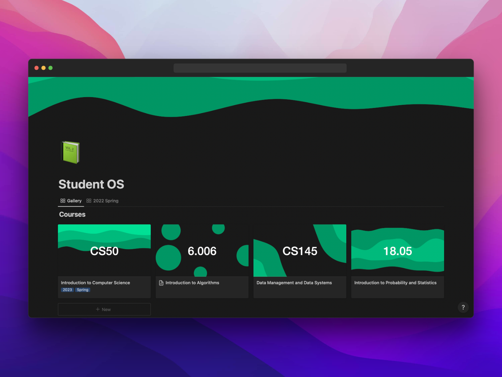

This is a really lightweight project that generates SVGs for any kind of background image. But use as you wish. If you want to expand themes and colors contribute right now, Codebase is really lightweight and anyone can add some features!

## Current themes and types

Currently there are 5 colors:

- green
- blue
- red
- yellow
- purple
  

4 SVG types which are:

- wave
- circle
- blob
- stacked

## Example use

```

https://notion-cover-generator-two.vercel.app/api?theme=green&type=stacked&text=CS50

```

Generates this:

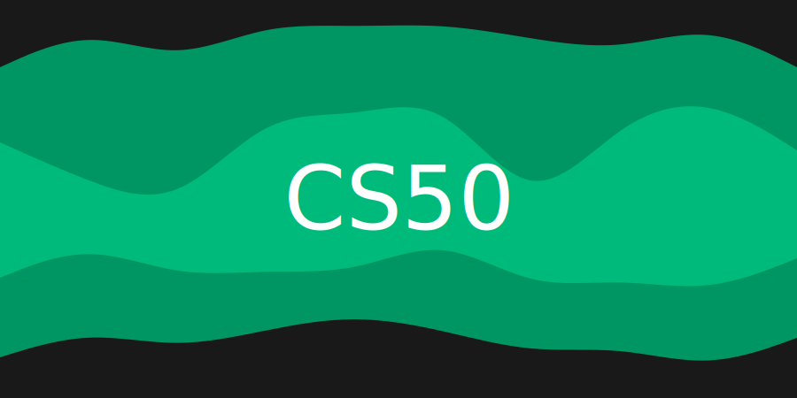


## All other theme and types


### Green


```

https://notion-cover-generator-two.vercel.app/api?theme=green&type=wave&text=CS50

```

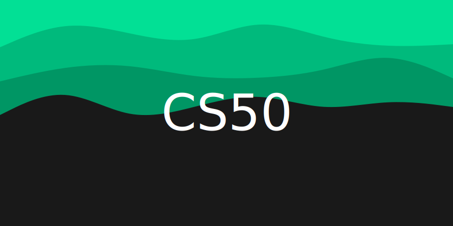

<hr/>

```

https://notion-cover-generator-two.vercel.app/api?theme=green&type=circle&text=CS50

```

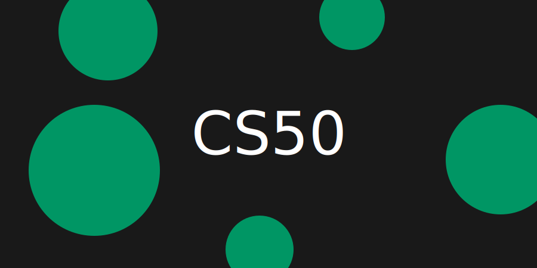

<hr/>

```

https://notion-cover-generator-two.vercel.app/api?theme=green&type=blob&text=CS50

```

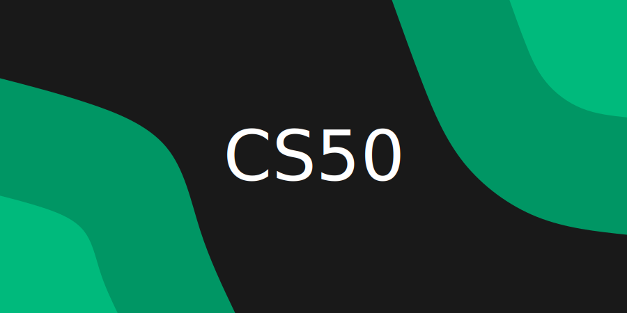

<hr/>

```

https://notion-cover-generator-two.vercel.app/api?theme=green&type=stacked&text=CS50

```


### Purple


```

https://notion-cover-generator-two.vercel.app/api?theme=purple&type=wave&text=CS50

```


<hr/>

```

https://notion-cover-generator-two.vercel.app/api?theme=purple&type=circle&text=CS50

```

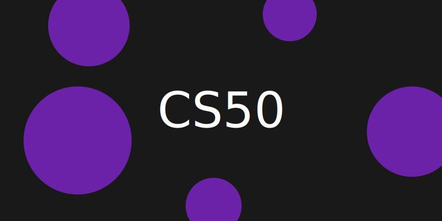

<hr/>

```

https://notion-cover-generator-two.vercel.app/api?theme=purple&type=blob&text=CS50

```


<hr/>

```

https://notion-cover-generator-two.vercel.app/api?theme=purple&type=stacked&text=CS50

```

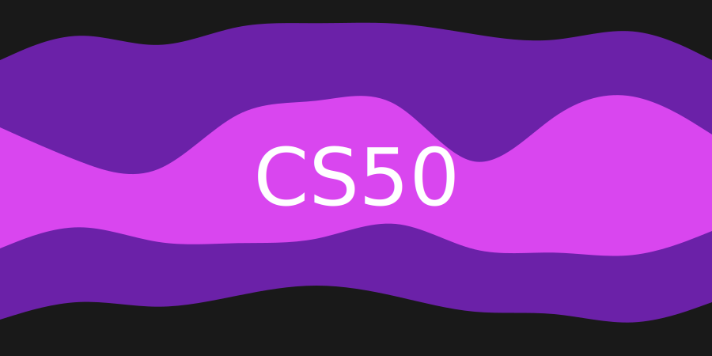


### Blue


```

https://notion-cover-generator-two.vercel.app/api?theme=blue&type=wave&text=CS50

```

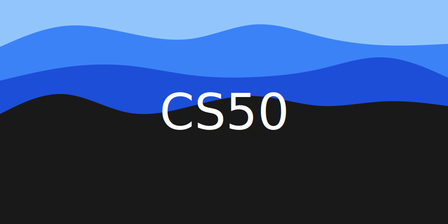

<hr/>

```

https://notion-cover-generator-two.vercel.app/api?theme=blue&type=circle&text=CS50

```

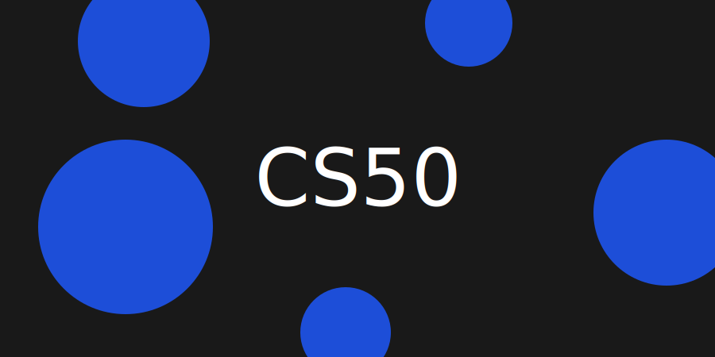

<hr/>

```

https://notion-cover-generator-two.vercel.app/api?theme=blue&type=blob&text=CS50

```


<hr/>

```

https://notion-cover-generator-two.vercel.app/api?theme=blue&type=stacked&text=CS50

```

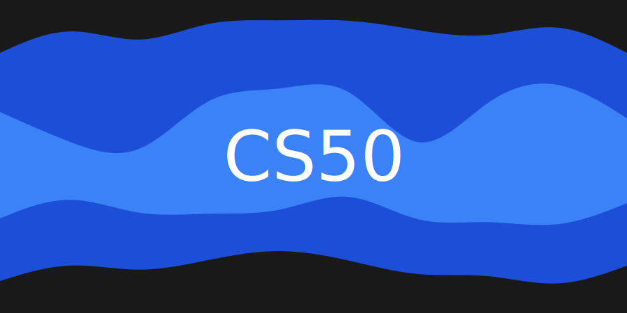


### Yellow


```

https://notion-cover-generator-two.vercel.app/api?theme=yellow&type=wave&text=CS50

```

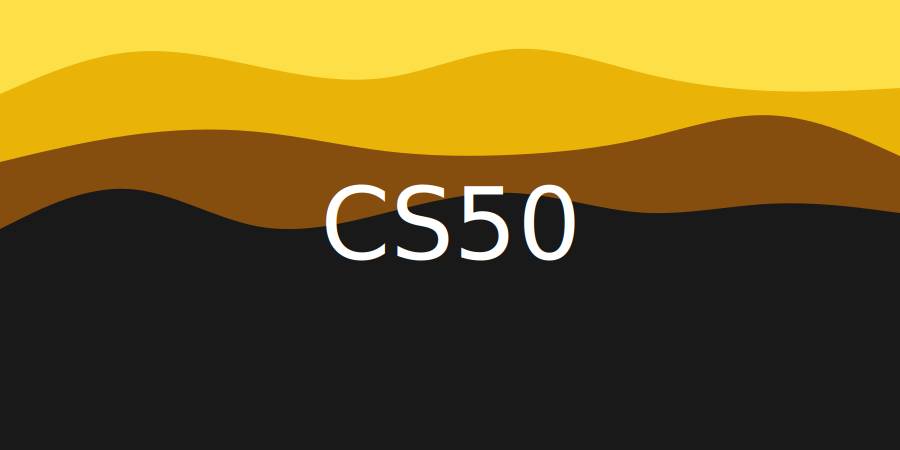

<hr/>

```

https://notion-cover-generator-two.vercel.app/api?theme=yellow&type=circle&text=CS50

```

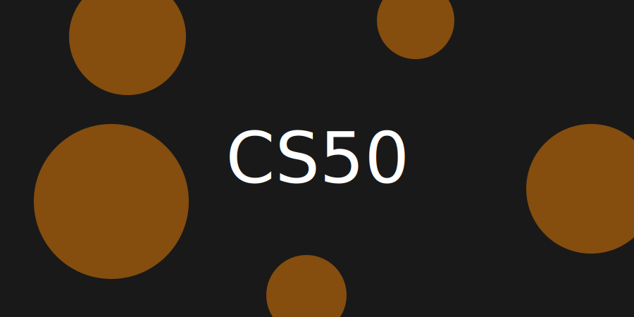

<hr/>

```

https://notion-cover-generator-two.vercel.app/api?theme=yellow&type=blob&text=CS50

```

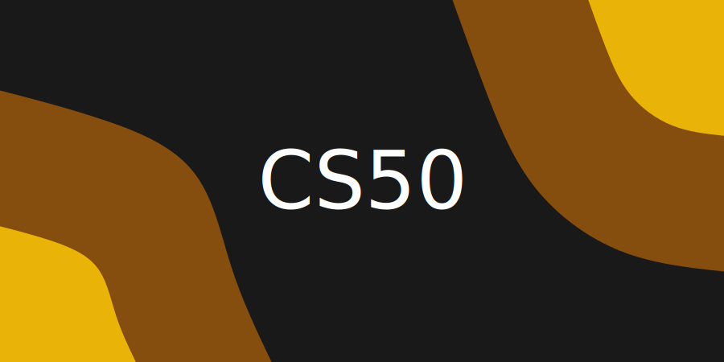

<hr/>

```

https://notion-cover-generator-two.vercel.app/api?theme=yellow&type=stacked&text=CS50

```

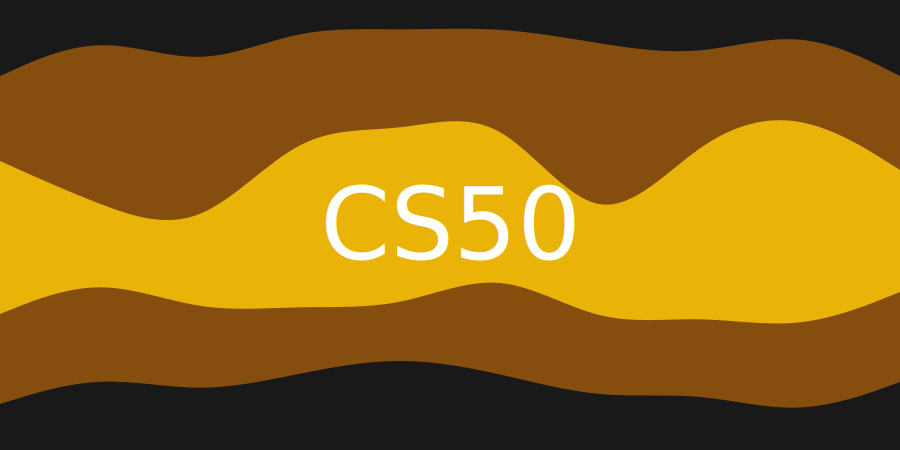


### Red


```

https://notion-cover-generator-two.vercel.app/api?theme=red&type=wave&text=CS50

```

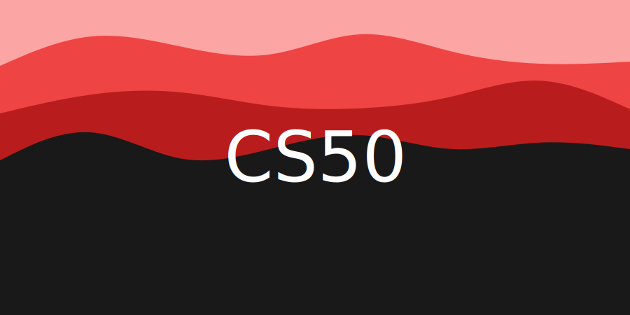

<hr/>

```

https://notion-cover-generator-two.vercel.app/api?theme=red&type=circle&text=CS50

```

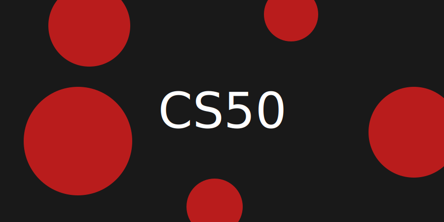

<hr/>

```

https://notion-cover-generator-two.vercel.app/api?theme=red&type=blob&text=CS50

```

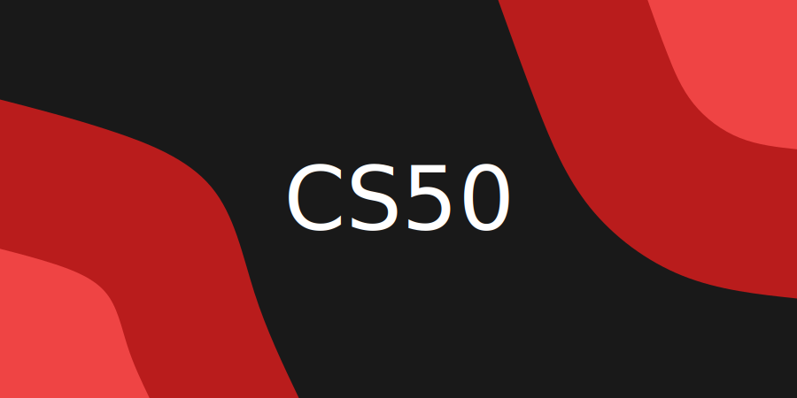

<hr/>

```

https://notion-cover-generator-two.vercel.app/api?theme=red&type=stacked&text=CS50

```

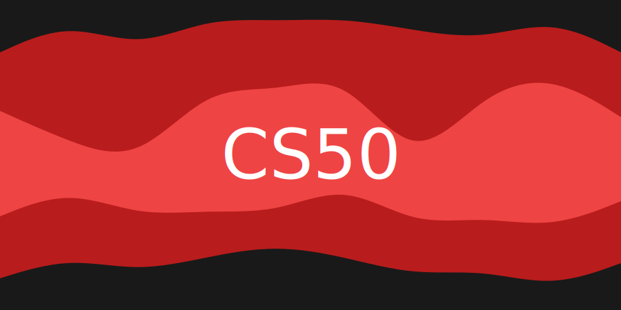